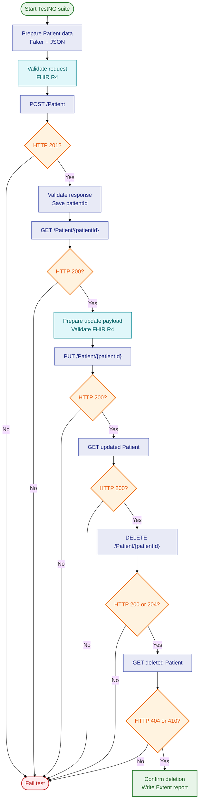

<div align="center">

# FHIR Patient API Automation

### Rest Assured • TestNG • HAPI FHIR R4 • Extent Reports

<p>
  
  
  
  
  
</p>

<p>
  <strong>A complete API automation workflow for creating and retrieving FHIR R4 Patient resources.</strong>
</p>

<p>
  <a href="https://github.com/Sameer-Programmer/2026_RestassuredWorkFlowDemo_FHIR/actions"></a>
  <a href="https://fhir-bootcamp.medblocks.com/fhir/metadata"></a>
  
</p>

</div>

---

## Contents

- [Project overview](#project-overview)
- [What the workflow verifies](#what-the-workflow-verifies)
- [End-to-end workflow](#end-to-end-workflow)
- [Technology stack](#technology-stack)
- [Project structure](#project-structure)
- [Prerequisites](#prerequisites)
- [Setup](#setup)
- [Run the tests](#run-the-tests)
- [Step-by-step implementation](#step-by-step-implementation)
- [Validation coverage](#validation-coverage)
- [Reports and results](#reports-and-results)
- [Configuration](#configuration)
- [Troubleshooting](#troubleshooting)
- [Future improvements](#future-improvements)

## Project overview

This repository demonstrates a maintainable **REST API automation framework** for a FHIR R4 Patient workflow. It uses **Rest Assured** to send HTTP requests, **TestNG** to control the test lifecycle, **Java Faker** to create unique patient data, and **HAPI FHIR** to validate that request and response bodies conform to FHIR R4.

The workflow is intentionally business-oriented:

1. Generate a unique Patient payload.
2. Validate the outgoing JSON as a FHIR R4 resource.
3. Create the Patient with `POST /Patient`.
4. Retrieve the created Patient with `GET /Patient/{patientId}`.
5. Build a new complete Patient resource containing the same ID.
6. Validate and update the Patient with `PUT /Patient/{patientId}`.
7. Retrieve the updated Patient and verify the persisted changes.
8. Delete the test Patient and verify that it is no longer retrievable.

> **Verified result:** The complete create/read/update/delete workflow was executed against the configured HAPI FHIR server with **6 tests passed, 0 failures, and 0 skipped**. The server returned `200 OK` for DELETE and `410 Gone` when the deleted Patient was read afterward.

## What the workflow verifies

| Layer | Verification |
|---|---|
| Transport | Correct HTTP methods, FHIR media types, and expected status codes (`201` for create, `200` for read/update/delete) |
| Schema | Request and response resources pass HAPI FHIR R4 validation |
| Resource identity | `resourceType` is `Patient`; the response contains a non-empty ID |
| Patient data | Name, phone, gender, birth date, and address values match generated input |
| Workflow chaining | The ID returned by POST is passed through GET, PUT, post-update GET, DELETE, and deletion verification |
| Test observability | TestNG lifecycle events are published to an Extent HTML report |

## End-to-end workflow



## Technology stack

| Technology | Version / role |
|---|---|
| Java | 21 |
| Maven | Project build and dependency management |
| Rest Assured | HTTP API execution and JSON path assertions |
| TestNG | Test suite, ordering, dependencies, and assertions |
| HAPI FHIR | FHIR R4 parsing and validation |
| Java Faker | Dynamic patient names, phone numbers, and addresses |
| Extent Reports | HTML execution report |
| Log4j 2 | Logging dependencies/configuration |

## Project structure

```text
2026_RestassuredWorkFlowDemo_FHIR/
├── pom.xml                                  # Dependencies and Maven test configuration
├── testNg.xml                               # TestNG suite and Extent listener registration
├── TestData/
│   └── patient.json                          # FHIR Patient template with placeholders
├── src/test/java/api/
│   ├── endPoints/
│   │   └── PatientEndpoints.java             # POST, GET, PUT, and DELETE methods
│   ├── payload/
│   │   ├── PatientData.java                  # Generated values carried through assertions
│   │   ├── PayLoadPatient.java               # Create payload generation
│   │   └── PatientUpdateData.java            # Complete update payload generation
│   ├── test/
│   │   └── PatientTest.java                  # Create → get → update → get → delete workflow
│   └── utilities/
│       ├── ConfigReader.java                 # Environment property loading
│       ├── ExtentReportManager.java          # Report initialization
│       ├── ExtentTestListener.java           # TestNG-to-Extent integration
│       └── FhirValidatorUtil.java            # HAPI FHIR R4 validation helper
├── src/test/resources/
│   ├── Config-DevRoute.properties            # POST, GET, PUT, and DELETE routes
│   └── log4j2.xml                            # Logging configuration placeholder
└── test-output/
    └── ExtentReport.html                     # Generated HTML execution report
```

## Prerequisites

Install the following before running the project:

- **JDK 21** with `JAVA_HOME` configured.
- **Apache Maven 3.9+** available as `mvn`.
- Internet access to download Maven dependencies and reach the configured FHIR server.
- A terminal, IntelliJ IDEA, Eclipse, or another Java IDE.

Verify the local tools:

```bash
java -version
mvn -version
```

## Setup

### 1. Clone the repository

```bash
git clone https://github.com/Sameer-Programmer/2026_RestassuredWorkFlowDemo_FHIR.git
cd 2026_RestassuredWorkFlowDemo_FHIR
```

### 2. Review the environment routes

Open `src/test/resources/Config-DevRoute.properties`:

```properties
post_url=https://fhir-bootcamp.medblocks.com/fhir/Patient
get_url=https://fhir-bootcamp.medblocks.com/fhir/Patient/{patientId}
update_url=https://fhir-bootcamp.medblocks.com/fhir/Patient/{patientId}
delete_url=https://fhir-bootcamp.medblocks.com/fhir/Patient/{patientId}
```

The `{patientId}` token is replaced at runtime with the ID returned by the create request.

### 3. Resolve Maven dependencies

```bash
mvn dependency:resolve
```

The required dependencies are declared in `pom.xml`, including Rest Assured, TestNG, HAPI FHIR R4, Java Faker, Jackson, JSON Schema validation, and Extent Reports.

## Run the tests

### Run the configured TestNG suite

```bash
mvn clean test
```

The Maven Surefire plugin is configured to execute `testNg.xml`, which runs the `Patient API Tests` suite.

### Run against another environment file

`ConfigReader` reads the `env` system property and defaults to `Dev`:

```java
String environment = System.getProperty("env", "Dev");
```

To add another environment, create a matching file such as:

```text
src/test/resources/Config-QA-Route.properties
```

Then run:

```bash
mvn clean test -Denv=QA
```

The environment file must expose the same keys:

```properties
post_url=https://your-server.example/fhir/Patient
get_url=https://your-server.example/fhir/Patient/{patientId}
update_url=https://your-server.example/fhir/Patient/{patientId}
delete_url=https://your-server.example/fhir/Patient/{patientId}
```

## Step-by-step implementation

### Step 1: Load route configuration

`ConfigReader.initProperties()` loads `Config-DevRoute.properties` or the file selected with `-Denv`. This keeps endpoint URLs out of the Java test logic.

### Step 2: Build dynamic patient data

`PayLoadPatient.getPatientPayload()` uses Java Faker to create a first name, last name, phone number, street, city, state, and postal code. The gender and birth date are currently fixed values.

The method reads `TestData/patient.json` and replaces placeholders such as:

```text
{{firstName}}
{{lastName}}
{{phone}}
{{street}}
{{city}}
{{state}}
{{postalCode}}
```

It returns a `PatientData` object containing both the final JSON payload and the generated values used later for exact response assertions.

### Step 3: Validate the request as FHIR R4

Before sending the request, `FhirValidatorUtil.validate(payload)` uses:

```java
FhirContext.forR4()
```

A validation failure prints the HAPI FHIR messages and throws an `AssertionError`, preventing an invalid resource from being submitted.

### Step 4: Create a Patient with POST

`PatientEndpoints.createPatient()` sends:

```http
POST /fhir/Patient
Content-Type: application/fhir+json
```

The test expects HTTP `201 Created`.

### Step 5: Validate the create response

After the POST, the test validates:

- FHIR R4 response validity.
- `resourceType == "Patient"`.
- A non-null and non-blank Patient ID.
- Family name and given name.
- Phone number.
- Valid FHIR gender value.
- Birth date.
- Street, city, state, and postal code.

### Step 6: Pass the Patient ID to the next test

The generated ID is placed in TestNG's shared `ITestContext`:

```java
context.setAttribute("patientId", patientId);
```

This creates the dependency between the create and retrieve operations without hard-coding an ID.

### Step 7: Retrieve the Patient with GET

The second test is declared with:

```java
@Test(dependsOnMethods = "createPatient")
```

It reads the ID from `ITestContext`, replaces `{patientId}` in the configured URL, and sends:

```http
GET /fhir/Patient/{patientId}
Accept: application/fhir+json
```

The test expects HTTP `200 OK`.

### Step 8: Validate the retrieved resource

The GET response is checked for:

- FHIR R4 validity.
- `resourceType == "Patient"`.
- The same Patient ID returned by POST.
- A present name collection.
- A present gender.
- A present birth date.

### Step 9: Build and validate the update payload

`PatientUpdateData.create(patientId)` generates a fresh set of patient values and reads the same `TestData/patient.json` template. It adds the existing server-generated `id` to the JSON document, which is required for a FHIR instance-level PUT.

The update request is validated as FHIR R4 before it is sent. The new generated values are retained in the `PatientUpdateData` object so the response can be checked against the exact update input.

### Step 10: Update the Patient with PUT

`PatientEndpoints.updatePatient()` sends:

```http
PUT /fhir/Patient/{patientId}
Content-Type: application/fhir+json
Accept: application/fhir+json
```

The configured HAPI FHIR server supports the standard Patient `update` interaction. The test expects HTTP `200 OK`, validates the response as FHIR R4, confirms the resource ID is unchanged, and checks the updated name, phone, birth date, and address values.

### Step 11: Retrieve and verify the updated Patient

`getUpdatedPatient` depends on `updatePatient`, retrieves the same resource with GET, and verifies that the updated values persisted on the server. This final read protects against an API that returns a successful PUT response but does not persist the changes.

The complete TestNG dependency chain is:

```text
createPatient
    ↓
getPatient
    ↓
updatePatient
    ↓
getUpdatedPatient
```

### Step 12: Delete the Patient

`PatientEndpoints.deletePatient()` sends:

```http
DELETE /fhir/Patient/{patientId}
Accept: application/fhir+json
```

The test accepts HTTP `200 OK` or `204 No Content` and stores the deleted ID for the final verification step. The configured HAPI FHIR server currently returns `200 OK`. The delete is deliberately placed at the end of the chain so the create, read, and update assertions can run against a real resource first.

### Step 13: Verify deletion

`verifyPatientDeleted` performs a final GET against the deleted resource and accepts HTTP `404 Not Found` or `410 Gone`. The configured HAPI FHIR server currently returns `410 Gone` with an OperationOutcome stating that the resource was deleted. This confirms that the server no longer exposes the test Patient after the DELETE call.

The complete TestNG dependency chain is:

```text
createPatient
    ↓
getPatient
    ↓
updatePatient
    ↓
getUpdatedPatient
    ↓
deletePatient
    ↓
verifyPatientDeleted
```

### Step 14: Publish the execution report

`ExtentTestListener` creates a report test for every TestNG method, marks it passed/failed/skipped, and flushes the report at suite completion.

## Validation coverage

### Request validation

The request template represents a FHIR Patient resource with:

- `resourceType: Patient`
- Official name
- Mobile phone telecom entry
- Administrative gender
- Birth date
- Address
- Boolean demographic fields

### Response validation

The workflow combines three complementary validation styles:

1. **Protocol validation** — status codes and media types.
2. **FHIR validation** — HAPI FHIR R4 structural and semantic validation.
3. **Business assertions** — generated input must match the persisted response.

This combination catches both malformed FHIR documents and incorrect API behavior.

## Reports and results

After execution, open the generated report in a browser:

```text
test-output/ExtentReport.html
```

The checked-in report currently shows:

| Test | Result | Purpose |
|---|---:|---|
| `createPatient` | **PASS** | Creates and validates a Patient resource |
| `getPatient` | **PASS** | Retrieves and validates the created Patient |
| `updatePatient` | **PASS** | Updates and validates the Patient resource with PUT |
| `getUpdatedPatient` | **PASS** | Confirms the updated values persisted after GET |
| `deletePatient` | **PASS** | Deletes the test Patient; server returned `200` |
| `verifyPatientDeleted` | **PASS** | Confirms the deleted Patient returns `410 Gone` |

To remove old output before a new run:

```bash
rm -rf test-output
mvn clean test
```

> Do not treat an old HTML report as proof of a fresh execution. Always run `mvn clean test` when you need current results.

## Configuration

The following Maven properties are defined in `pom.xml`:

- Java source/target: `21`
- Test suite: `testNg.xml`
- Surefire plugin: `3.5.3`
- Rest Assured: `5.5.6`
- TestNG: `7.11.0`
- HAPI FHIR libraries: `8.12.1`
- Extent Reports: `5.1.2`

The endpoint is intentionally external and environment-specific. For team or CI use, prefer injecting endpoint values through a secure environment-specific properties file or CI variables instead of committing sensitive or private URLs.

## Troubleshooting

| Symptom | Likely cause | Resolution |
|---|---|---|
| `mvn: command not found` | Maven is not installed or not on `PATH` | Install Maven 3.9+ and verify with `mvn -version` |
| `release version 21 not supported` | The active JDK is older than 21 | Install JDK 21 and update `JAVA_HOME` |
| `FileNotFoundException` for route config | Test started from the wrong working directory | Run Maven from the repository root |
| HTTP `404` on GET | The returned ID was not captured or the server removed the resource | Inspect the POST response and confirm the route configuration |
| HTTP `401`/`403` | The target FHIR server requires authentication | Add the required authentication in `PatientEndpoints` and keep credentials out of source control |
| FHIR validation failure | Resource is malformed or not compatible with R4 | Review the HAPI FHIR validation messages printed by `FhirValidatorUtil` |
| Tests run out of order | The suite was not started through `testNg.xml` | Use `mvn clean test` or run the configured TestNG suite |

## Future improvements

- Add a Maven Wrapper (`mvnw`) for reproducible local and CI execution.
- Move endpoint selection to CI variables or a dedicated environment manager.
- Add negative tests for invalid Patient payloads and unknown Patient IDs.
- Add schema assertions for required response headers and FHIR metadata.
- Add request/response logging with secrets and personal data masked.
- Add parallel-safe test data cleanup or a non-persistent test environment.
- Add CI execution and publish the Extent report as a build artifact.

## License

No license file is currently included. Add a license before distributing the project outside its intended learning or internal-use context.

<div align="center">

**Built as a practical FHIR API automation workflow**

</div>
